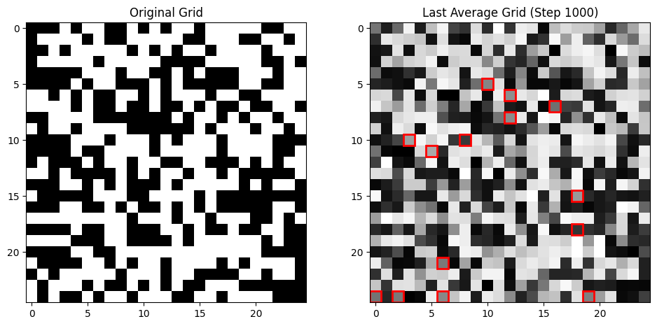

# Information Spread Simulation

This repository contains a simulation of information spread across a network of agents using agent-based modeling. Each agent has a grid that represents their perception of information, which evolves over time based on interactions with other agents. The simulation explores how varying error rates affect the consensus and information propagation among agents.

  
  

## Features

- **Agent-Based Modeling**: Simulates how agents update their grids based on interactions with neighbors and random agents.
- **Error Rate Variations**: Test different error rates to observe their impact on consensus formation and grid evolution.
- **Visualization**: Provides plots of the original grid, last average grid, and error metrics (MSE) over time.
- **Network Visualization**: Optionally visualizes the network of agents as a complete graph.

## Components

- **`InformationAgent` Class**: Represents an agent with a grid that evolves over time due to interactions and random errors.
- **`InformationSpreadModel` Class**: Manages the simulation, including agent interactions, grid updates, and computation of metrics.
- **Simulation Scripts**: Includes scripts to run the simulation and visualize results.

